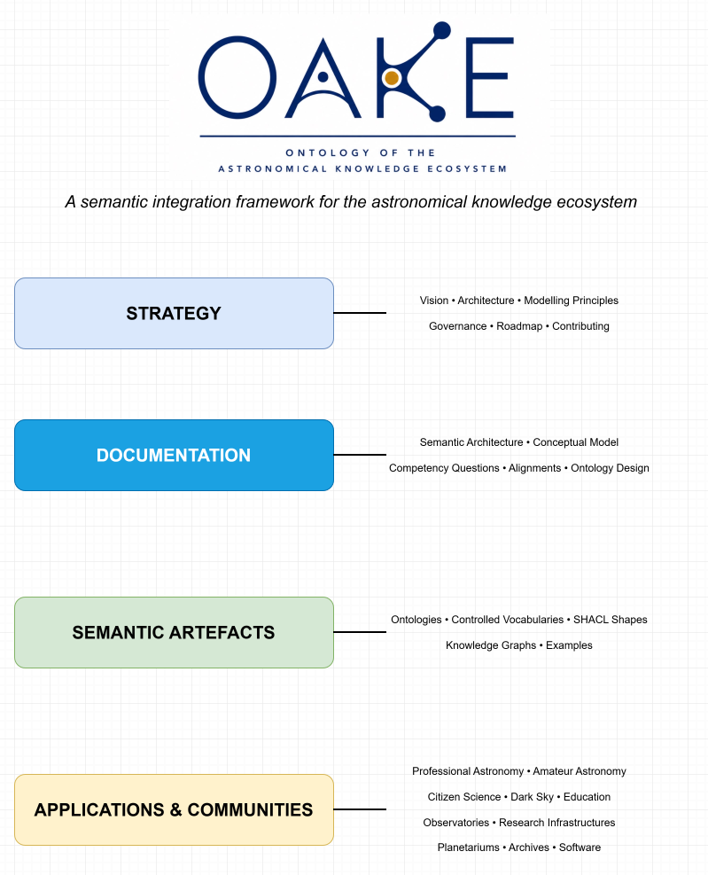
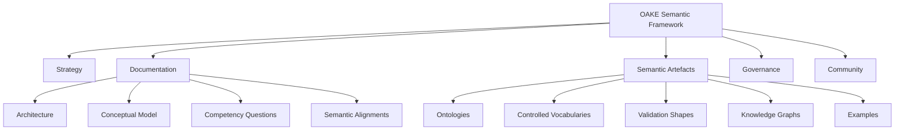
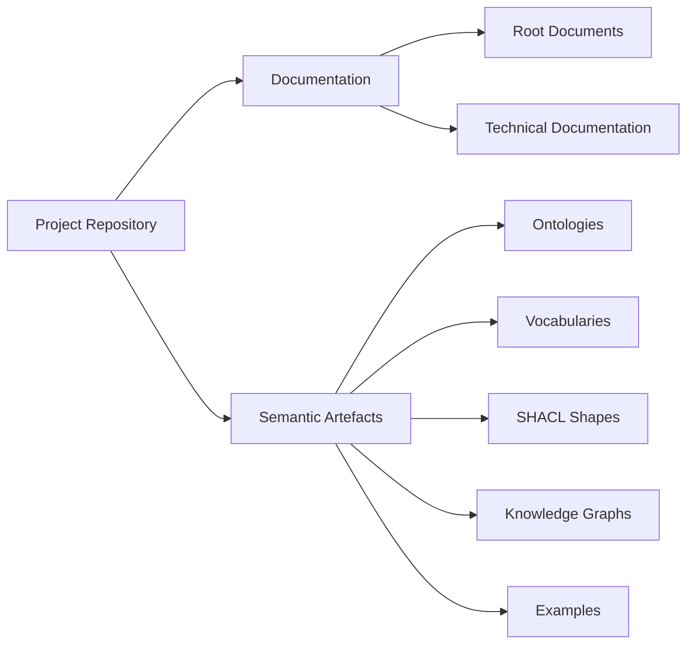
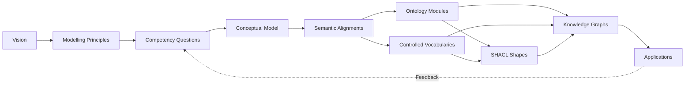

# OAKE Architecture

## Purpose

This document describes the overall architecture of OAKE (Ontology of the Astronomical Knowledge Ecosystem).

OAKE is conceived as a semantic integration framework for the astronomy ecosystem rather than as a single ontology.

Its architecture defines how documentation, semantic artefacts, governance and community processes are organised to support the long-term development of interoperable semantic resources.

This document focuses on the organisation of the project itself.

The semantic relationships between ontologies, controlled vocabularies, validation profiles and knowledge graphs are described separately in `docs/semantic-architecture.md`.

## Overall Architecture

**Figure 1. Overall architecture of OAKE.**



Figure&nbsp;1 provides a high-level overview of the OAKE project.

Rather than representing a single ontology, it illustrates the different layers that together form the OAKE semantic framework.

The architecture is organised into four complementary layers:

- **Strategy**, which defines the long-term vision, governance and modelling principles of the project;
- **Documentation**, which describes the conceptual foundations and semantic design;
- **Semantic Artefacts**, which provide the machine-readable resources developed within OAKE;
- **Applications and Communities**, which reuse these resources in practical contexts.

Information flows progressively from strategic decisions to conceptual documentation, then to semantic artefacts and finally to their implementation in real-world applications.

Feedback from implementations and community experience may in turn lead to revisions of the documentation and, when necessary, to updates of the project roadmap or modelling principles.

The following sections describe each architectural layer in greater detail.

---

# Design Goals

The architecture of OAKE has been designed to satisfy several complementary objectives.

## Modularity

OAKE should remain modular.

Each component should have a clearly defined responsibility and should evolve independently whenever possible.

The architecture should allow new semantic modules to be added without requiring major changes to existing components.

---

## Reuse

OAKE follows a reuse-first philosophy.

Whenever an existing ontology, vocabulary or semantic standard already provides an appropriate solution, it should be reused rather than duplicated.

This principle applies to both conceptual modelling and technical implementation.

---

## Separation of Concerns

Different categories of semantic artefacts should remain clearly separated.

In particular, OAKE distinguishes between:

- documentation;
- ontology modules;
- controlled vocabularies;
- validation shapes;
- knowledge graphs;
- examples.

Keeping these artefacts independent simplifies maintenance and improves long-term sustainability.

---

## Community-driven Development

OAKE is intended to become a collaborative community project.

The repository architecture should therefore facilitate:

- external contributions;
- transparent decision making;
- documented design choices;
- progressive peer review;
- reproducible releases.

---

## FAIR Semantic Resources

OAKE aims to produce semantic artefacts that are consistent with the FAIR principles.

Consequently, every artefact should, whenever appropriate:

- have persistent identifiers;
- include machine-readable metadata;
- specify provenance;
- be versioned;
- provide explicit licensing information;
- be documented for both humans and machines.

---

# Architectural Overview

OAKE is organised around several complementary components.



Each component has its own lifecycle while remaining consistent with the overall vision of the project.

The repository architecture reflects this separation.

---

# Repository Architecture

The repository is organised into two major categories of resources.

1. **Project documentation**, intended primarily for humans.

2. **Semantic artefacts**, intended primarily for machines, while remaining understandable by humans.

This distinction is illustrated below.



The documentation explains the project.

The semantic artefacts implement it.

Neither should duplicate the role of the other.

# Project Components

OAKE is composed of several complementary components.

Each component has a well-defined responsibility and lifecycle.

The separation of these components improves maintainability, facilitates collaboration and supports the long-term evolution of the project.

| Component | Purpose | Primary Audience |
|-----------|---------|------------------|
| Documentation | Describe the conceptual and technical foundations of OAKE | Humans |
| Ontologies | Define concepts, properties and semantic axioms | Humans & Machines |
| Controlled Vocabularies | Provide shared terminology and classifications | Humans & Machines |
| Validation Shapes | Define application-specific validation constraints | Machines |
| Knowledge Graphs | Describe real-world entities and their relationships | Humans & Machines |
| Examples | Illustrate recommended modelling patterns and usage | Humans |

Although these components are closely related, they should remain independent whenever possible.

---

# Repository Organisation

The repository is organised according to the role of each artefact rather than according to technical implementation.

```text
/
├── README.md
├── VISION.md
├── MODELLING_PRINCIPLES.md
├── ARCHITECTURE.md
├── ROADMAP.md
├── GOVERNANCE.md
├── CONTRIBUTING.md
├── LICENSE
├── CITATION.cff
│
├── docs/
├── ontology/
├── vocabularies/
├── shapes/
├── knowledge-graphs/
└── examples/
```

The root directory contains project-wide documentation.

Each remaining directory groups semantic artefacts having a common purpose.

---

# Root-Level Documents

The files located at the repository root describe the project as a whole.

They are intended to remain relatively stable and to provide the entry point for contributors and users.

| Document | Purpose |
|-----------|---------|
| README.md | Project overview and entry point |
| VISION.md | Long-term objectives and scientific motivation |
| MODELLING_PRINCIPLES.md | Principles guiding semantic modelling |
| ARCHITECTURE.md | Overall organisation of the project |
| ROADMAP.md | Planned development phases |
| GOVERNANCE.md | Decision-making and project governance |
| CONTRIBUTING.md | Contribution process and development guidelines |
| LICENSE | Licensing information |
| CITATION.cff | Citation metadata |

These documents define the strategic foundation of OAKE.

---

# Documentation Directory

```text
docs/
```

The `docs/` directory contains conceptual and technical documentation.

Unlike the files located at the repository root, these documents focus on the semantic design of OAKE rather than on project governance.

Typical documents include:

- semantic architecture;
- conceptual model;
- competency questions;
- ontology design;
- semantic alignments;
- implementation notes;
- diagrams.

The documentation should remain implementation-independent whenever possible.

Its objective is to explain **why** modelling decisions have been taken rather than merely documenting the resulting ontology.

---

# Ontology Directory

```text
ontology/
```

The `ontology/` directory contains the OWL ontology modules developed within OAKE.

The ontology implementation should remain as lightweight as possible.

Its primary role is to define:

- concepts;
- semantic relationships;
- axioms;
- ontology metadata.

The ontology should not duplicate concepts already available in widely adopted semantic standards unless there is a documented justification.

The directory is organised into two main parts.

```text
ontology/
├── core/
└── modules/
```

## Core

The core contains the concepts shared by the entire framework.

It should remain intentionally small and highly stable.

Every addition to the core should be justified by competency questions and reviewed against the Modelling Principles.

## Modules

Modules contain specialised semantic models.

Each module should:

- define a clearly delimited scope;
- minimise dependencies;
- reuse external ontologies whenever possible;
- include appropriate documentation.

Modules should be independently maintainable.

---

# Controlled Vocabularies Directory

```text
vocabularies/
```

Controlled vocabularies describe classifications rather than conceptual structures.

Whenever appropriate, they should be represented using SKOS.

Typical vocabularies include:

- organisation types;
- activity types;
- observation methods;
- instrument categories;
- operational status;
- certification types;
- astronomy domains;
- roles.

Controlled vocabularies are expected to evolve more frequently than ontology modules.

Keeping them separate improves long-term flexibility.

---

# Validation Shapes Directory

```text
shapes/
```

The `shapes/` directory contains validation rules expressed using SHACL.

Validation rules describe expected data structures for specific applications.

They are intentionally separated from ontology semantics.

A validation profile may specify:

- mandatory properties;
- cardinalities;
- expected datatypes;
- controlled vocabulary membership;
- identifier patterns;
- application-specific constraints.

Different applications may use different SHACL profiles while sharing the same ontology.

---

# Knowledge Graphs Directory

```text
knowledge-graphs/
```

Knowledge graphs contain RDF instance data describing the astronomy ecosystem.

Examples include:

- organisations;
- observatories;
- instruments;
- projects;
- datasets;
- software;
- observing sites;
- citizen-science initiatives;
- semantic resources.

Knowledge graphs should reuse ontology modules and controlled vocabularies without modifying them.

Multiple independent knowledge graphs may coexist within the OAKE ecosystem.

---

# Examples Directory

```text
examples/
```

Examples provide practical demonstrations of recommended modelling patterns.

Typical examples include:

- Turtle snippets;
- JSON-LD examples;
- SPARQL queries;
- SHACL validation examples;
- competency question demonstrations;
- ontology alignment examples.

Examples are non-normative.

Their purpose is educational rather than prescriptive.

# Relationships Between Components

The different components of OAKE are not independent.

They form a coherent development workflow in which each component builds upon the previous one.



This workflow is iterative.

Experience gained during implementation or community feedback may require revisions to competency questions, alignments or modelling decisions.

However, all changes should remain consistent with the project vision and modelling principles.

---

# Development Workflow

OAKE follows a gradual development process.

Rather than beginning with ontology implementation, development starts with the identification of community needs.

The recommended workflow is:

1. Identify a community need.
2. Formulate competency questions.
3. Review existing semantic resources.
4. Define conceptual requirements.
5. Document semantic alignments.
6. Decide whether the solution belongs in:
   - an ontology;
   - a controlled vocabulary;
   - a SHACL profile;
   - a knowledge graph.
7. Produce examples.
8. Implement semantic artefacts.
9. Validate the implementation.
10. Publish a new release.

Every modelling decision should be traceable back to competency questions.

---

# Dependency Management

OAKE promotes explicit and limited dependencies.

Each dependency should be documented together with its purpose.

Dependencies may include:

- ontology reuse;
- controlled vocabularies;
- identifier systems;
- metadata vocabularies;
- validation profiles.

Whenever possible, OAKE should reuse individual concepts instead of importing complete ontologies.

Complete `owl:imports` statements should only be introduced when they provide clear long-term benefits.

Each dependency should document:

- the external resource;
- its version policy;
- its licence;
- the reused concepts;
- expected maintenance implications.

---

# Versioning Strategy

Different project components evolve at different rates.

| Component | Expected Stability |
|-----------|-------------------|
| Vision | Very High |
| Modelling Principles | Very High |
| Architecture | High |
| Conceptual Model | High |
| Ontology Core | High |
| Ontology Modules | Medium |
| Controlled Vocabularies | Medium |
| SHACL Shapes | Medium |
| Knowledge Graphs | Variable |
| Examples | Variable |

Ontology releases should remain stable.

Knowledge graphs and examples may evolve more frequently.

Version numbers should therefore be managed independently whenever appropriate.

---

# Release Philosophy

OAKE distinguishes between conceptual maturity and implementation maturity.

For example:

- a modelling principle may already be considered stable;
- a conceptual model may still evolve;
- an ontology module may remain experimental;
- a knowledge graph may be updated continuously.

The maturity of each artefact should therefore be documented independently.

Possible lifecycle states include:

- Draft
- Experimental
- Candidate
- Stable
- Deprecated

These states should appear in the metadata of published artefacts whenever appropriate.

---

# Repository Evolution

The repository structure has been designed to support gradual expansion.

Future directories may be added as the project evolves.

Examples include:

```text
scripts/
mappings/
queries/
tests/
releases/
```

New directories should only be introduced when they correspond to a distinct category of artefacts.

The repository should remain easy to navigate.

---

# Design Principles

Several architectural principles guide repository evolution.

## Keep components independent

Each directory should have a single primary responsibility.

## Avoid duplication

Information should be documented once.

Other documents should reference it rather than repeating it.

## Prefer documentation over assumptions

Architectural decisions should always be documented.

Future contributors should understand *why* a decision was taken.

## Minimise dependencies

Components should depend on as few external resources as possible.

## Support reuse

The repository should encourage reuse of both internal and external semantic artefacts.

---

# Future Evolution

The current architecture represents an initial foundation.

It is expected to evolve as:

- new competency questions emerge;
- additional ontology modules are developed;
- controlled vocabularies expand;
- knowledge graphs become available;
- new communities contribute to OAKE.

The overall architectural principles, however, are intended to remain stable.

---

# Relationship with Other Documents

This document complements the other root-level documents.

| Document | Primary Question |
|-----------|------------------|
| README.md | What is OAKE? |
| VISION.md | Why does OAKE exist? |
| ARCHITECTURE.md | How is OAKE organised? |
| MODELLING_PRINCIPLES.md | How should semantic modelling decisions be made? |
| GOVERNANCE.md | How are decisions made? |
| CONTRIBUTING.md | How can the community contribute? |
| ROADMAP.md | What comes next? |

The technical documentation contained in the `docs/` directory describes the semantic design itself and should be read together with this document.

---

# Current Status

The architecture presented in this document should be considered the initial reference architecture of OAKE.

It establishes a clear separation between:

- project governance;
- scientific documentation;
- ontology engineering;
- controlled vocabularies;
- validation;
- knowledge graphs.

This separation is intended to improve maintainability, encourage collaboration and facilitate the long-term evolution of the OAKE ecosystem.

As new semantic artefacts are developed, this architecture may evolve incrementally while preserving its overall design principles.
