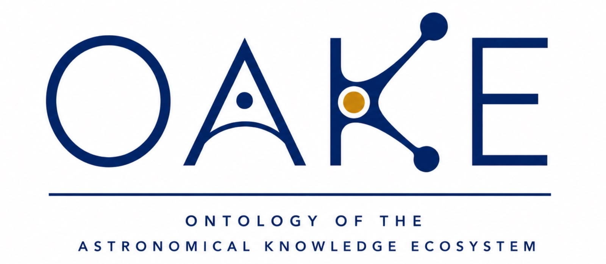

  

# OAKE

**Ontology of the Astronomical Knowledge Ecosystem**

> A semantic foundation for connecting the worldwide astronomy ecosystem.

## Overview

Astronomy is one of the most collaborative scientific disciplines, bringing together professional observatories, space agencies, research infrastructures, amateur astronomers, citizen-science initiatives, educational institutions, public outreach organisations and environmental monitoring networks.

These communities produce, exchange and reuse a wide variety of knowledge resources, including observations, datasets, software, publications, educational materials, standards and services.

Although many semantic resources already exist for specific domains, there is currently no ontology providing a unified description of the Astronomical Knowledge Ecosystem as a whole.

OAKE aims to fill this gap.

## Objectives

OAKE aims to:

- provide a shared conceptual model of the astronomical knowledge ecosystem;
- improve interoperability between heterogeneous astronomical resources;
- support FAIR knowledge graphs;
- facilitate semantic integration across professional and amateur astronomy;
- promote the reuse of existing ontologies whenever possible.

## Project status

**Current status:** early conceptual design (v0.1)

The repository currently focuses on defining the vision, scope and conceptual foundations of the ontology before its implementation in OWL.

## Repository roadmap

- Vision paper
- Conceptual model
- Competency questions
- Ontology specification
- Example knowledge graphs
- Documentation

## Contributing

The project is currently under active development.

Contributions, comments and discussions are welcome.

## License

OAKE is licensed under the Creative Commons Attribution 4.0 International License (CC BY 4.0).

SPDX identifier: `CC-BY-4.0`
