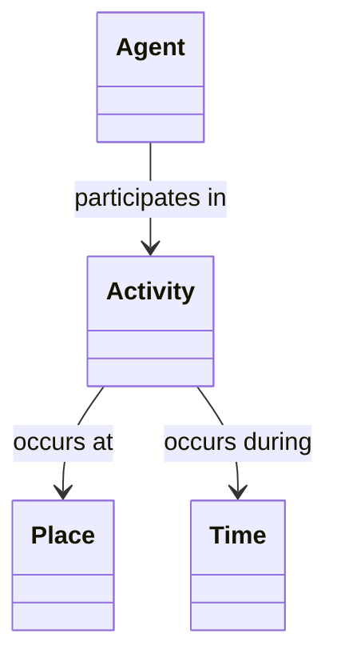
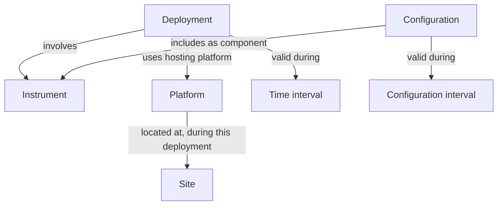

# OAKE Conceptual Model

## Purpose

This document describes the conceptual foundation of the Ontology for the Astronomical Knowledge Ecosystem (OAKE).

Rather than introducing a new upper ontology, OAKE relies on a small number of universal anchors and promotes the coordinated reuse of existing semantic artefacts.

The objective is to provide a stable conceptual foundation for semantic interoperability across the astronomy ecosystem.

This revision connects the conceptual model to [CQ1–CQ39](competency-questions.md). It defines conceptual requirements and working modelling choices; it does not constitute a final OWL schema or a set of validated semantic alignments.

---

## Conceptual approach

The OAKE conceptual model is intentionally minimal.

Four fundamental questions provide general anchors for describing activities within the astronomy ecosystem.

| Fundamental question | Concept |
| --- | --- |
| Who? | Agent |
| What happens? | Activity |
| Where? | Place |
| When? | Time |

These anchors do not constitute an exhaustive model of the astronomical ecosystem. OAKE also connects organisations, people, observing facilities, instruments, networks, datasets and other astronomical resources.

Entities and relationships can be described independently of a recorded activity. For example, describing an association, an instrument model or a network does not require inventing an activity.

The anchors provide a general structuring framework. Competency questions and use cases identify additional concepts and relationships, whose implementation should first be sought in existing semantic resources.

## Conceptual relationships

All diagram labels in this document are conceptual. They do not declare OAKE classes or properties, cardinalities, domain/range axioms or equivalences with external ontologies.

Participation can be qualified by a role. An activity may involve several agents and places, and its temporal description may be an instant or an interval, according to the use case.

---

## Domain distinctions

The following distinctions refine the existing model without automatically expanding the OAKE ontology.

| Conceptual requirement | Working distinction | Competency questions |
| --- | --- | --- |
| Agent, organisation and role | Separate an actor's identity from its role in an activity, resource operation or network participation. | CQ1, CQ4, CQ8, CQ12, CQ16–CQ20, CQ31 |
| Activity and observation | Treat observation and night-sky measurement as specialised activity requirements; preserve links to the target, instrument, place, time and result. Formal class alignments remain to be validated. | CQ2–CQ10, CQ21–CQ23 |
| Instrument, type and model | Distinguish a physical device from its functional category and its device model. | CQ6, CQ11, CQ15, CQ22, CQ37 |
| Installation and components | Describe an observing installation's components and their configuration when that detail is needed and supported by metadata. | CQ15, CQ37 |
| Place, site and platform | A site identifies a geographical location or area; a platform supports or hosts equipment. Co-location does not establish hosting. | CQ7, CQ13, CQ18, CQ30, CQ36 |
| Observing facility | Describe the observing infrastructure as needed, distinguishing its operator, sites and equipment. Do not assume every facility is identical to a site or platform. | CQ20, CQ28, CQ30, CQ32–CQ35, CQ38 |
| Deployment and operational status | A deployment describes an instrument's installation context over a period. Being deployed does not imply being operational throughout that period. | CQ13–CQ14, CQ34–CQ36 |
| Network and participation | Distinguish the network from its coordinating organisations, participating entities and their roles or participation periods. | CQ19, CQ31–CQ35 |
| Resource and access | Connect datasets, images, services and knowledge resources to the relevant entities and activities, including access information when available. | CQ10, CQ23, CQ28, CQ32–CQ33, CQ38 |
| Recognition and criterion | Distinguish a recognition scheme from a particular award, its recipient place, awarding organisation, applicable criteria and validity period. | CQ24–CQ27 |
| Territory and ecosystem | Support geographical and temporal selection of entities and their relationships. Distinguish physical location from an organisation's area of activity. | CQ18, CQ29–CQ35 |
| Statement and provenance | Trace descriptions and relationship assertions to their sources, separately from the periods when the described facts apply. | CQ39; supports all other questions |

### Instruments, installations and deployments

An instrument retains its identity when it moves between platforms or sites. A new installation context is described through a new deployment rather than a new identity for the same device.

A configuration groups the relevant components for a specified period. For example, a camera installation may include a camera body and a lens, each with its own model. Component replacement and relocation are different changes and need not occur together.

The following pattern expresses the requirements behind CQ36 and CQ37:

Platform location must be qualified in time when it can change. Mobile installations may require locations or trajectories associated with a deployment or observation rather than a single permanent site.

An instrument may also form part of a more complex instrument. The level of component detail is driven by the questions to answer, not by a requirement to describe every physical part.

### Organisations, networks and participation

Network membership, coordination, station operation, ownership and contribution are distinct relationships. They should not be inferred from each other without evidence.

A network may have organisational, instrumental and service dimensions. OAKE does not yet impose a single class mapping for all of them. The intended meaning must be established before selecting an implementation pattern.

A territorial graph can describe actors and resources from several networks alongside entities with no network affiliation.

### Time and provenance

The model distinguishes:

- **Validity time:** when a deployment, configuration, participation, operational status or recognition applies.
- **Description update time:** when a statement about that fact was updated.
- **Ingestion time:** when the statement was incorporated into a knowledge graph.

These dates are not interchangeable. Unknown dates remain unspecified. Current records alone do not establish historical continuity.

Provenance should be recoverable for the relevant statement. It may be recorded for an individual assertion or for an identified group of statements sharing the same source and processing history; the RDF implementation remains to be selected.

### Results, resources and recognition

Observation results and their published representations should be distinguished where necessary: a result may be made available through a dataset, image or service.

The initial network graphs can reference these resources without ingesting complete observation streams or archives.

For dark-sky recognition, the model must connect the awarded recognition to the relevant place, awarding organisation, validity period and criteria. An award is not itself a measurement of current sky conditions.

---

## Reused semantic artefacts

OAKE retains the reuse-first orientation of the initial conceptual model.

| Need | Preferred resource or candidate to evaluate |
| --- | --- |
| Agent and activity | PROV-O |
| Place and spatial relationships | GeoSPARQL |
| Organisation | W3C ORG |
| Person | FOAF |
| Time | OWL-Time |
| Observation and result | SOSA/SSN |
| Instrument, platform and deployment | SOSA/SSN; SAREF and SAREF4ENVI for complementary device requirements |
| Dataset and data service | DCAT |
| Observing facility and astronomical target | Relevant IVOA resources, alongside the observation requirements of SOSA/SSN |
| Criterion | CCCEV |
| Recognition | Certification and labelling resources, including Schema.org candidates, to evaluate |
| Controlled vocabularies | SKOS |
| Provenance | PROV-O |
| Metadata | Dublin Core |
| Ontology metadata | MOD |

The table records reuse directions, not blanket imports or approved equivalence axioms. Each implementation choice must identify the external terms and versions used and assess their semantic commitments against the competency questions.

The initial reuse directions for observation results, organisations and criteria are retained. In particular, a reusable observation-result pattern must not be assumed to cover every possible result of an educational or organisational activity.

### Implications for the OAKE ontology

A named domain concept does not automatically require an OAKE-specific class.

OAKE should introduce new terms only when existing semantic resources cannot adequately represent a demonstrated requirement. Its core ontology may remain very small, potentially containing no domain classes where external resources suffice.

Controlled vocabularies can supply roles, classifications and categories where appropriate. Whether a device model is represented by a literal, an identified resource or another pattern remains an explicit modelling decision.

---

## Semantic artefacts and project organisation

Two complementary distinctions are needed.

### Types of semantic artefacts

| Artefact | Function |
| --- | --- |
| Ontologies | Define concepts, relationships and semantic constraints. |
| Controlled vocabularies | Provide shared terminology, classifications, roles and types. |
| Knowledge graphs | Describe domain instances and relationships using the selected ontologies and vocabularies. |

Controlled vocabularies remain a first-class part of OAKE. They are not replaced by the distinction between the core and extensions.

### Organisation of the ecosystem

| Layer | Responsibility |
| --- | --- |
| Shared OAKE foundation | Document common modelling patterns, reuse choices, vocabulary references and any justified OAKE terms. |
| Optional extensions | Address additional requirements with a clear scope when the shared foundation and existing resources are insufficient. |
| Independent knowledge graphs | Maintain instance data, source provenance, coverage, versions and update responsibilities for each application. |

Ontology schema and application instance data are maintained separately. Graphs record the model and vocabulary versions they use.

A knowledge graph can use the shared foundation without requiring a dedicated extension. Concepts demonstrated to be useful across applications can be considered for the shared foundation through the governance process.

---

## Initial applications and coverage

The intended sequence follows the roadmap: TESS / STARS4ALL, Allsky, FRIPON, then the astronomy ecosystem in Brittany. These are proposed applications; network-specific choices are to be discussed with the relevant teams.

| Application | Main conceptual requirements | Initial CQ coverage |
| --- | --- | --- |
| TESS / STARS4ALL | Photometers, sites, deployments, operators, network participation and resource access | CQ11–CQ15, CQ20–CQ23, CQ31, CQ36, CQ38–CQ39 |
| Allsky | Camera installations, camera–lens configurations, sites, contributors and image or service access | CQ11–CQ15, CQ30–CQ31, CQ36–CQ39 |
| FRIPON | Stations, instruments, sites, participating organisations and network roles | CQ12–CQ15, CQ19–CQ20, CQ31, CQ36, CQ38–CQ39 |
| Astronomy in Brittany | Organisations, activities, places, facilities, resources, networks and territorial relationships | CQ1–CQ4, CQ16–CQ20, CQ24–CQ35, CQ38–CQ39 |

Coverage does not imply that every source contains the required data. Observations and their results remain within OAKE's scope even where an initial graph concentrates on infrastructure metadata.

Shared identifiers or documented identity links should connect descriptions of the same real-world entity across graphs. Matching names or coordinates alone is insufficient to establish identity.

---

## Illustrative validation scenario

This fictional scenario tests the conceptual distinctions without assuming a partnership or a real network deployment.

| Entity or relationship | Example |
| --- | --- |
| Instrument | Camera C1, with device model M1 |
| Other component | Lens L1, with device model M2 |
| Initial configuration | Configuration K1 includes C1 and L1 during interval T1 |
| Initial deployment | Deployment D1 installs C1 on platform P1 at site S1 during T1 |
| Later deployment | Deployment D2 installs the same C1 on platform P2 at site S2 during a later, non-overlapping interval T2 |
| Operation | Organisation A operates C1 during T1 and T2 |
| Network participation | C1 participates in network N during T1; participation during T2 is unknown |
| Accessible resource | Service V provides access to images associated with C1 during T1 |
| Provenance | Source R supports these statements; their description update time is recorded separately from T1 and T2 |

Expected answers:

- **CQ36:** return D1/P1/S1 for a date within T1 and D2/P2/S2 for a date within T2, preserving the identity C1.
- **CQ37:** return C1/M1 and L1/M2 for configuration K1 during T1. Do not assume L1 remains installed during T2.
- **CQ31:** return participation in N during T1. Do not infer continued participation during T2 from the device's unchanged identity.
- **CQ38:** return service V and its documented access information for the relevant period.
- **CQ39:** identify source R and the description update time without treating that time as a deployment date.

These are expected outcomes for a future RDF fixture and queries, not results of an implemented validation.

---

## Open modelling decisions

- [ ] Select and version the concrete patterns for instrument type, device model and component configuration.
- [ ] Resolve the boundaries between observing facility, installation, station, site and platform using representative cases.
- [ ] Select patterns for network dimensions, participation roles and validity periods.
- [ ] Select temporal patterns for deployments, configuration changes, operational status and changing locations.
- [ ] Select a provenance pattern that makes assertion sources and update times recoverable.
- [ ] Validate recognition, awarding and criterion patterns against CQ24–CQ27.
- [ ] Implement the fictional example in RDF and verify its expected answers before declaring the selected patterns validated.

## Modular extensions

Potential areas remain Observation, Instrumentation, Organisations, Citizen science, Education, Dark-sky and Semantic artefacts.

They are candidate scopes, not a requirement to create one module per domain or one ontology per knowledge graph. Any extension should document its dependency on the shared foundation and its demonstrated added value.

## Relationship with the Modelling Principles

This conceptual model follows the OAKE Modelling Principles:

- MP1 — Reuse before creating
- MP2 — Keep the conceptual model intentionally small
- MP3 — Prefer modularity
- MP4 — Prefer generic semantic relations
- MP5 — Prefer controlled vocabularies

Future revisions should remain consistent with these principles and retain traceability to the competency questions.

