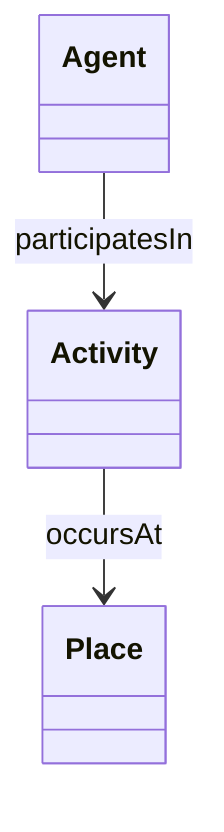

# OAKE Core Conceptual Model

## Purpose

This document describes the conceptual foundation of OAKE.

Rather than introducing a new upper ontology, OAKE relies on a small number of universal concepts and promotes the coordinated reuse of existing semantic artefacts.

The objective is to provide a stable conceptual foundation for semantic interoperability across the astronomy ecosystem.

---

# Conceptual approach

The OAKE Core is intentionally minimal.

Rather than modelling every concept of astronomy, it focuses on three fundamental questions that can describe any activity within the astronomy ecosystem.

| Fundamental question | Concept |
|----------------------|---------|
| Who? | Agent |
| What happens? | Activity |
| Where? | Place |

These concepts constitute the conceptual anchors of OAKE.

---

# Conceptual relationships



The relationships shown above are conceptual only.

Their implementation may rely on existing ontologies rather than OAKE-specific properties.

---

# Reused semantic artefacts

OAKE promotes the coordinated reuse of existing semantic standards.

| Need | Preferred semantic artefact |
|------|-----------------------------|
| Agent | PROV-O |
| Activity | PROV-O |
| Place | GeoSPARQL |
| Organisation | W3C ORG |
| Person | FOAF |
| Time | OWL-Time |
| Observation | SOSA / SSN |
| Dataset | DCAT |
| Controlled vocabularies | SKOS |
| Provenance | PROV-O |
| Metadata | Dublin Core |
| Ontology metadata | MOD |

This table will evolve as new semantic resources are evaluated.

---

# Conceptual layers

OAKE distinguishes three complementary semantic layers.

```text
                OAKE

        Semantic Framework
               │
    ┌──────────┼──────────┐
    │          │          │
Ontology   Vocabulary   Knowledge Graph
```

## Ontologies

Define concepts and semantic relationships.

## Controlled vocabularies

Define shared terminology, classifications, roles and types.

## Knowledge graphs

Contain domain-specific instances.

---

# Modular extensions

The conceptual core is expected to support specialised modules.

Examples include:

- Observation
- Instrumentation
- Organisations
- Citizen science
- Education
- Dark-sky
- Semantic artefacts

These modules remain independent while sharing the same conceptual foundation.

---

# Relationship with the Modelling Principles

This conceptual model follows the OAKE Modelling Principles.

In particular:

- MP1 — Reuse before creating
- MP2 — Keep the conceptual core intentionally small
- MP3 — Prefer modularity
- MP4 — Prefer generic semantic relations
- MP5 — Prefer controlled vocabularies

Future revisions of this document should remain consistent with these principles.
