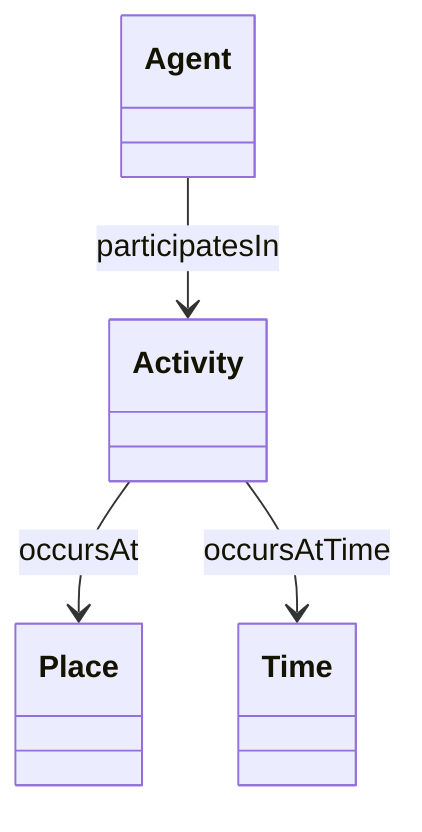

# OAKE Conceptual Model

## Purpose

This document describes the conceptual foundation of OAKE.

Rather than introducing a new upper ontology, OAKE relies on a small number of universal anchors and promotes the coordinated reuse of existing semantic artefacts.

The objective is to provide a stable conceptual foundation for semantic interoperability across the astronomy ecosystem.

---

# Conceptual approach

The OAKE conceptual model is intentionally minimal.

Rather than modelling every concept of astronomy, it focuses on three fundamental questions that can describe any activity within the astronomy ecosystem.

| Fundamental question | Concept |
|----------------------|---------|
| Who? | Agent |
| What happens? | Activity |
| Where? | Place |
| When? | Time |

These concepts constitute the conceptual anchors of OAKE.

---

# Conceptual relationships



The relationships shown above are conceptual only.

Their implementation may rely on existing ontologies rather than OAKE-specific properties.

---

# Reused semantic artefacts

OAKE promotes the coordinated reuse of existing semantic standards.

| Need | Preferred semantic artefact |
|------|-----------------------------|
| Agent | PROV-O |
| Activity | PROV-O |
| Place | GeoSPARQL |
| Organisation | W3C ORG |
| Person | FOAF |
| Time | OWL-Time |
| Observation | SOSA / SSN |
| Dataset | DCAT |
| Criterion | CCCEV |
| Controlled vocabularies | SKOS |
| Provenance | PROV-O |
| Metadata | Dublin Core |
| Ontology metadata | MOD |

This table will evolve as new semantic resources are evaluated.

---

## Concepts identified through competency questions

The competency questions may reveal additional domain concepts beyond the four conceptual anchors.

These concepts do not automatically become OAKE-specific classes. Existing semantic resources should first be evaluated in accordance with the OAKE reuse-first approach.

The conceptual anchors should therefore be distinguished from domain concepts: the former provide a general structuring framework, while the latter emerge from specific competency questions and use cases.

For example:

- **Result** — reuse `sosa:Result`.
- **Organisation** — reuse `org:Organization`.
- **Instrument** — domain concept requiring further alignment with existing semantic resources, particularly SOSA/SSN.
- **Target** — domain concept requiring further evaluation against `sosa:FeatureOfInterest` and existing astronomy-specific semantic resources.
- **Observing Facility** — domain concept requiring further alignment with existing semantic resources, particularly astronomy-specific resources developed within the IVOA ecosystem.
- **Recognition** — domain concept requiring further evaluation against existing semantic resources for certification, labelling and recognition schemes.
- **Criterion** — reuse the Core Criterion and Core Evidence Vocabulary (CCCEV), which provides a generic semantic model for criteria used for assessment or evaluation.

### Implications for the OAKE ontology

The analysis of competency questions does not imply that each identified concept should become an OAKE-specific class.

In accordance with the reuse-first approach, OAKE should introduce new ontology terms only when existing semantic resources cannot adequately represent the required concepts or relationships.

Consequently, the OAKE core ontology may remain intentionally very small, and potentially contain no domain classes where suitable external semantic resources already exist.
  
---

# Conceptual layers

OAKE distinguishes three complementary semantic layers.

```text
                OAKE

        Semantic Framework
               │
    ┌──────────┼──────────┐
    │          │          │
Ontology   Vocabulary   Knowledge Graph
```

## Ontologies

Define concepts and semantic relationships.

## Controlled vocabularies

Define shared terminology, classifications, roles and types.

## Knowledge graphs

Contain domain-specific instances.

---

# Modular extensions

The OAKE conceptual model is expected to support specialised modules.

Examples include:

- Observation
- Instrumentation
- Organisations
- Citizen science
- Education
- Dark-sky
- Semantic artefacts

These modules remain independent while sharing the same conceptual foundation.

---

# Relationship with the Modelling Principles

This conceptual model follows the OAKE Modelling Principles.

In particular:

- MP1 — Reuse before creating
- MP2 — Keep the conceptual model intentionally small
- MP3 — Prefer modularity
- MP4 — Prefer generic semantic relations
- MP5 — Prefer controlled vocabularies

Future revisions of this document should remain consistent with these principles.
