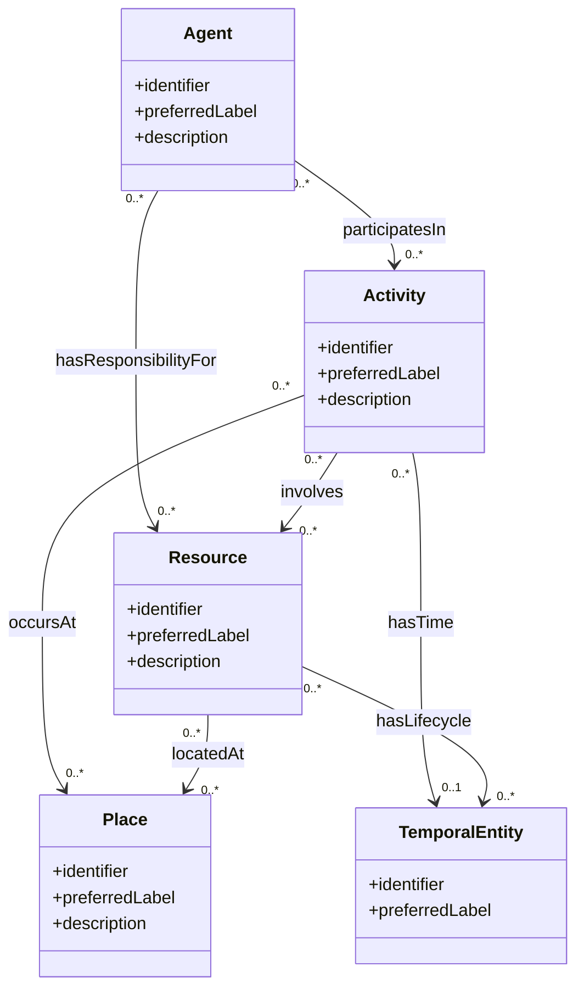

# OAKE Conceptual Model

## Status

This document presents the initial conceptual model of OAKE.

The model is deliberately small and generic. It is intended to provide
a stable integration layer for more specialised astronomy ontologies,
vocabularies and knowledge graphs.

## Core concepts

## Modelling principles

- The core must remain intentionally small.
- Existing ontologies should be reused before new OAKE classes or
  properties are introduced.
- Domain-specific concepts should be introduced through modular
  extensions.
- Categorical values should use controlled vocabularies and persistent
  identifiers.
- Temporal information must have an explicit semantic meaning.
- The temporal characteristics of real-world entities must be
  distinguished from the creation and modification dates of their
  descriptions.

## Provisional status

The classes and relation names shown in this document are conceptual.
They do not yet imply that OAKE will define equivalent OWL classes or
properties.

Each concept will be assessed against existing ontologies and tested
through competency questions and representative use cases.
