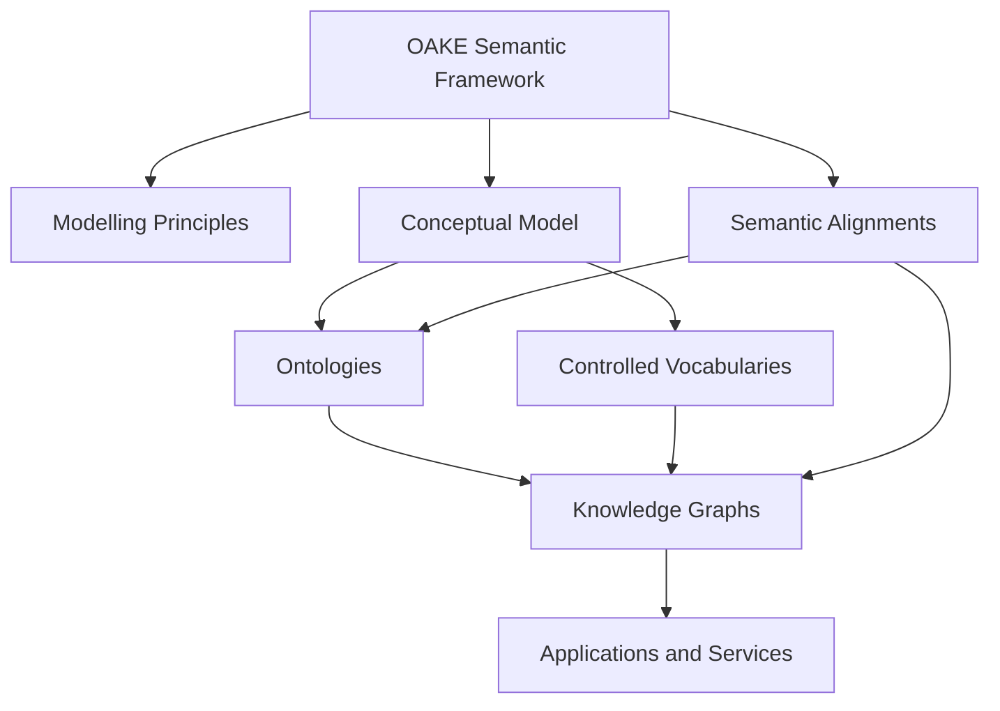
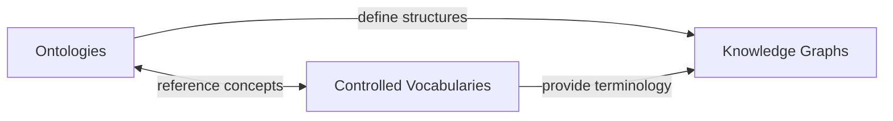
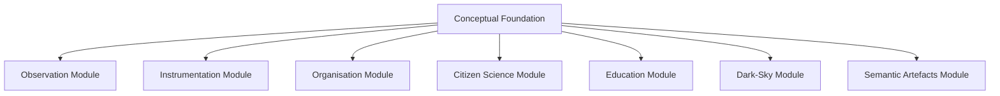
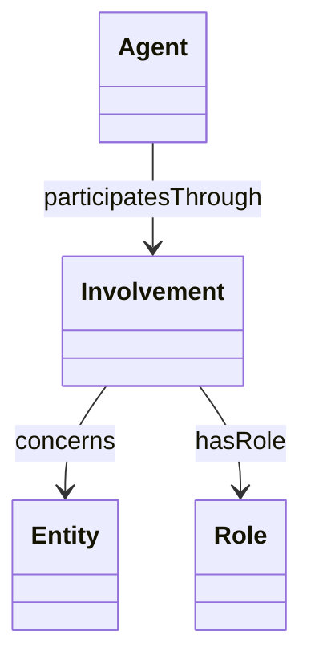
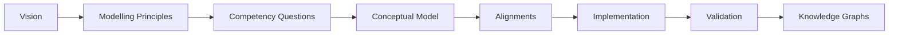

# OAKE Semantic Architecture

## Purpose

This document describes the semantic architecture of the Ontology of the Astronomical Knowledge Ecosystem (OAKE).

OAKE is conceived as a semantic integration framework rather than as a single monolithic ontology.

Its architecture defines how ontologies, controlled vocabularies, knowledge graphs, alignments and applications can work together to support semantic interoperability across the astronomy ecosystem.

This document focuses on the roles and relationships of these components. Detailed modelling decisions are described in the OAKE Modelling Principles and in the conceptual model.

---

## Architectural overview

OAKE is organised around several complementary semantic components.



The framework provides common principles and architectural guidance.

Ontologies define conceptual structures and semantic relationships.

Controlled vocabularies provide shared terminology and classifications.

Knowledge graphs contain domain-specific entities and statements.

Applications and services consume these semantic resources.

---

## Architectural principles

The semantic architecture follows the OAKE Modelling Principles.

In particular, it is designed to:

- reuse existing semantic artefacts before creating new ones;
- maintain a small and stable conceptual core;
- support independently maintained modules;
- prefer controlled vocabularies for classifications;
- separate conceptual models, terminology and instance data;
- preserve provenance and traceability;
- enable gradual adoption.

---

## Semantic framework

The OAKE semantic framework is the highest architectural level.

It does not correspond to a single RDF or OWL file.

It comprises:

- the project vision;
- the modelling principles;
- the conceptual model;
- competency questions;
- semantic alignments;
- ontology modules;
- controlled vocabularies;
- knowledge graphs;
- validation resources;
- documentation and examples.

The framework defines how these components should be developed and combined.

---

## Conceptual foundation

The conceptual foundation identifies a small number of concepts that recur throughout the astronomy ecosystem.

The current conceptual anchors are:

- Agent;
- Activity;
- Place.

They correspond to three fundamental questions:

| Question | Concept |
|---|---|
| Who is involved? | Agent |
| What happens? | Activity |
| Where does it happen? | Place |

These are conceptual anchors rather than necessarily OAKE-defined OWL classes.

Their implementation should rely on existing semantic standards whenever possible.

Additional concepts such as observation, instrument, dataset, organisation, project or publication belong to reused ontologies or specialised modules.

---

## Semantic layers

OAKE distinguishes three primary semantic layers.



### Ontology layer

Ontologies define:

- classes;
- properties;
- semantic constraints;
- conceptual relationships;
- formal axioms.

The ontology layer should remain as lightweight as possible.

OAKE should not reproduce concepts already defined in widely adopted ontologies.

Preferred external resources currently include:

| Semantic need | Preferred resource |
|---|---|
| Agents and provenance | PROV-O |
| Organisations | W3C ORG |
| Observations and sensors | SOSA/SSN |
| Spatial information | GeoSPARQL |
| Temporal information | OWL-Time |
| Datasets and data services | DCAT |
| General metadata | Dublin Core Terms |
| Ontology metadata | MOD |
| Controlled vocabularies | SKOS |

OAKE-specific ontology terms should only be introduced when no suitable reusable term exists and when the need is supported by competency questions.

### Controlled vocabulary layer

Controlled vocabularies provide shared terminology for classifications that may evolve independently of the ontology.

Typical examples include:

- agent roles;
- organisation types;
- activity types;
- instrument categories;
- observation types;
- project types;
- certification types;
- operational statuses;
- astronomy domains.

SKOS should normally be used to represent these vocabularies.

A vocabulary concept may be used to qualify a generic relation without requiring a new OWL property or subclass.

For example:

```text
Agent
  └── hasRole → Role

Role
  ├── Operator
  ├── Owner
  ├── Maintainer
  ├── Publisher
  └── Certifier
```

This approach supports multilingual labels, vocabulary evolution and community-specific terminology.

### Knowledge graph layer

Knowledge graphs contain instances describing the astronomy ecosystem.

Examples include:

- observatories;
- organisations;
- instruments;
- observation campaigns;
- citizen-science projects;
- datasets;
- software;
- certifications;
- places;
- people;
- semantic artefacts.

Knowledge graphs should reuse the ontology and vocabulary layers but remain separate from them.

Different communities may therefore maintain distinct knowledge graphs while relying on the same semantic framework.

Examples could include:

- a knowledge graph of astronomy organisations;
- a knowledge graph of dark-sky certifications;
- a knowledge graph of amateur observatories in Brittany;
- a knowledge graph of TESS photometers;
- a knowledge graph of semantic resources used in astronomy.

---

## Modular architecture

OAKE is designed as a modular framework.



A module may contain:

- ontology terms;
- alignments;
- competency questions;
- controlled vocabularies;
- SHACL shapes;
- examples;
- documentation.

Modules should remain independently maintainable.

They should reuse the conceptual foundation and external standards rather than directly depending on every other OAKE module.

Cross-module dependencies should be explicit, limited and justified.

---

## External semantic artefacts

OAKE is intended to integrate existing semantic artefacts.

These may include:

- ontologies;
- thesauri;
- taxonomies;
- code lists;
- identifier systems;
- knowledge graphs;
- metadata profiles;
- validation shapes.

External artefacts may be used in several ways:

### Direct reuse

An external class or property is used directly.

Example:

```turtle
ex:SomeOrganisation a org:Organization .
```

### Vocabulary reuse

An external SKOS concept is used as a classification value.

### Alignment

An OAKE or domain-specific concept is formally related to an external concept.

Possible alignment properties include:

- `owl:equivalentClass`;
- `owl:equivalentProperty`;
- `rdfs:subClassOf`;
- `rdfs:subPropertyOf`;
- `skos:exactMatch`;
- `skos:closeMatch`;
- `skos:broadMatch`;
- `skos:narrowMatch`;
- `skos:relatedMatch`.

Strong equivalence statements should only be used when semantic equivalence has been carefully verified.

### Mapping documentation

Where a formal RDF alignment would be too strong or premature, the relationship should be documented in the alignment documentation.

---

## Generic relations and qualified relations

OAKE should avoid creating a large number of narrowly specialised properties.

A generic relationship can instead be qualified using a role, relation type or intermediate entity.

For example, rather than defining separate properties such as:

```text
owns
operates
maintains
funds
coordinates
```

a qualified pattern may be used:



This pattern can also support additional information such as:

- start and end dates;
- provenance;
- certainty;
- contractual context;
- source;
- responsible organisation.

Simple direct properties may still be used when they are already well defined in an existing ontology or when the relation is unambiguous and widely applicable.

---

## Provenance

Provenance should be considered throughout the architecture.

PROV-O should be used whenever appropriate to describe:

- who created or modified a resource;
- which activity generated a dataset;
- which source supported a statement;
- when an artefact was produced;
- which version was used;
- how a knowledge graph was derived.

Provenance may apply to:

- complete datasets;
- named graphs;
- individual entities;
- individual assertions.

The appropriate granularity depends on the use case.

---

## Temporal and spatial context

Time and place are cross-cutting concerns.

Temporal information should preferably use OWL-Time.

Spatial information should preferably use GeoSPARQL and established geographic identifiers.

Spatial entities may be linked to:

- coordinates;
- geometries;
- administrative areas;
- observing sites;
- named geographic features.

OAKE should avoid creating astronomy-specific representations of time or space unless a specialised requirement cannot be represented by existing standards.

---

## Metadata and FAIRness

Each semantic artefact should be described by appropriate metadata.

Metadata should include, where applicable:

- title;
- description;
- creator;
- contributor;
- publisher;
- licence;
- version;
- creation date;
- modification date;
- namespace;
- persistent identifier;
- preferred citation;
- language;
- status;
- dependencies;
- imported ontologies;
- distribution formats.

The metadata approach should reuse standards such as:

- Dublin Core Terms;
- DCAT;
- MOD;
- PAV;
- PROV-O;
- ADMS;
- VoID.

Semantic artefacts should be published through persistent and dereferenceable identifiers whenever possible.

---

## Validation

Validation is distinct from ontology semantics.

OWL describes semantic meaning and supports inference.

SHACL should be used to describe data quality expectations and application profiles.

Validation rules may specify:

- required properties;
- expected value types;
- cardinalities;
- controlled vocabulary membership;
- identifier patterns;
- spatial or temporal requirements.

SHACL shapes should normally be maintained separately from ontology files.

Different applications may define different validation profiles while sharing the same ontology.

---

## Versioning and lifecycle

The components of OAKE have different expected rates of change.

| Component | Expected stability |
|---|---|
| Vision | Very high |
| Modelling principles | Very high |
| Conceptual model | High |
| Ontology core | High |
| Domain modules | Medium |
| Controlled vocabularies | Medium |
| SHACL profiles | Medium |
| Knowledge graphs | Variable and potentially rapid |
| Applications | Rapid |

Each published artefact should have an explicit version and status.

Possible statuses include:

- draft;
- experimental;
- candidate;
- stable;
- deprecated.

Breaking changes should be clearly documented.

Deprecated terms should remain identifiable and should point to their replacements when possible.

---

## Dependency management

Dependencies should be kept explicit and minimal.

An OAKE module should distinguish between:

- normative dependencies;
- optional dependencies;
- alignments;
- examples of reuse.

Importing a complete external ontology using `owl:imports` should not be automatic.

The implications of an import should be assessed, including:

- ontology size;
- reasoning complexity;
- availability;
- licensing;
- version stability;
- transitive dependencies.

Where appropriate, documentation or explicit term reuse may be preferable to importing a complete ontology.

---

## Distribution and publication

OAKE artefacts should be distributed in formats appropriate to their role.

Possible distributions include:

| Artefact | Possible formats |
|---|---|
| Ontology | Turtle, RDF/XML, JSON-LD |
| Controlled vocabulary | Turtle, JSON-LD, CSV |
| Knowledge graph | Turtle, TriG, N-Quads, JSON-LD |
| Validation profile | SHACL Turtle |
| Documentation | Markdown, HTML |
| Diagrams | Mermaid, SVG, PNG |

Human-readable documentation and machine-readable artefacts should be published together.

The provisional OAKE namespace is:

```text
https://w3id.org/astrosemantics/oake/
```

The namespace remains provisional until it has been reviewed with the relevant astronomy semantic communities.

---

## Repository organisation

The repository should reflect the semantic architecture.

```text
/
├── README.md
├── VISION.md
├── MODELLING_PRINCIPLES.md
├── ROADMAP.md
├── GOVERNANCE.md
├── CONTRIBUTING.md
├── LICENSE
├── CITATION.cff
│
├── docs/
│   ├── semantic-architecture.md
│   ├── conceptual-model.md
│   ├── competency-questions.md
│   ├── alignments.md
│   ├── ontology-design.md
│   └── images/
│
├── ontology/
│   ├── core/
│   └── modules/
│
├── vocabularies/
│
├── shapes/
│
├── knowledge-graphs/
│
└── examples/
```

The exact structure may evolve as concrete artefacts are developed.

---

## Architectural workflow

The recommended development sequence is:



This sequence is iterative rather than strictly linear.

Competency questions may reveal missing concepts.

Implementation may expose alignment problems.

Knowledge graphs may identify new vocabulary requirements.

Changes should nevertheless remain consistent with the vision and modelling principles.

---

## Relationship with other OAKE documents

This document should be read together with:

- `VISION.md`, which explains the long-term ambition of OAKE;
- `MODELLING_PRINCIPLES.md`, which defines the rules guiding modelling decisions;
- `docs/conceptual-model.md`, which describes the conceptual foundation;
- `docs/competency-questions.md`, which defines the questions OAKE should support;
- `docs/alignments.md`, which documents reused semantic artefacts and mappings;
- `ROADMAP.md`, which describes the planned development stages.

---

## Current status

The semantic architecture is currently a draft.

It is intended to guide the initial development of OAKE and will evolve through implementation, testing and community review.

Its purpose is not to fix the complete future architecture in advance, but to provide a coherent foundation for incremental development.
